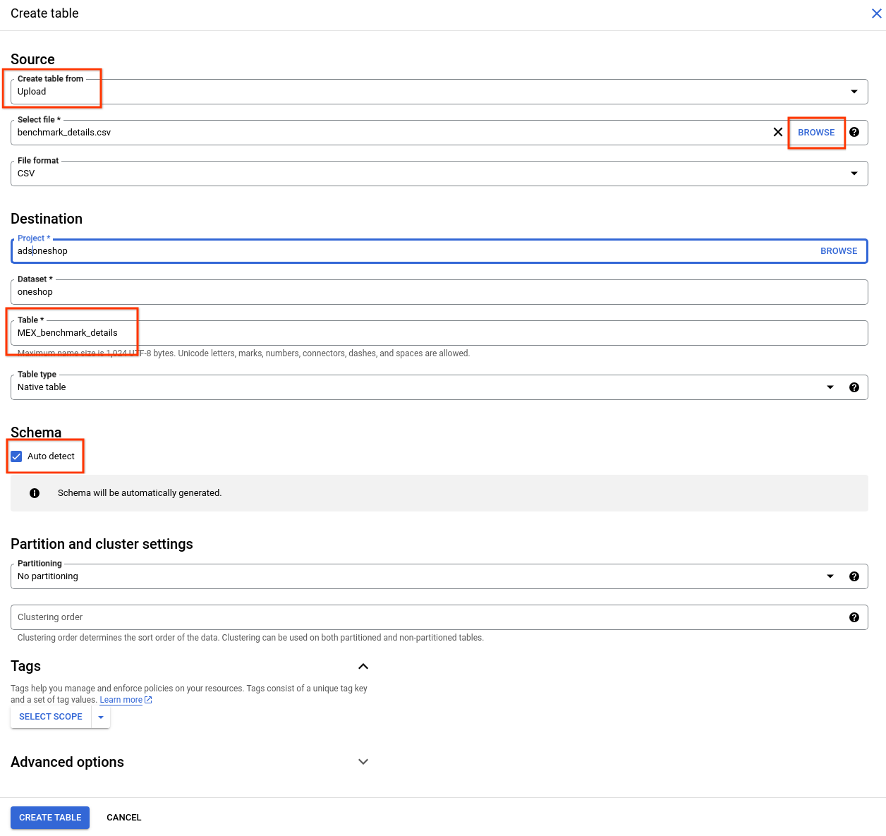

# Ads OneShop

## Overview

Ads OneShop helps merchants identify opportunities to improve product data and
feature adoption, benchmarking against top retailers to maximise performance.

By implementing these recommendations, merchants can improve offer quality,
reduce disapprovals, increase advanced feature adoption and drive better auction
performance.

### Solutions Included

The Ads OneShop project contains two solutions:

*   Advanced Commerce Insights Tool (ACIT) - A monitoring dashboard for product lifecycle
*   Merchant Excellence (MEX) - A best-practices dashboard for Google Merchant Center (GMC) accounts

## Setup

### Prerequisites

#### Google Ads

*   [**Developer Token**](https://developers.google.com/google-ads/api/docs/get-started/dev-token)

    *   Standard Access is best, but Basic will work for prototyping/testing.

    *   As with the OAuth consent screen, it's easiest to get approval if you
        submit the request for "internal use only" (you are your own client),
        that is, if you don't plan to open up your app directly (i.e., sign in
        page) to people outside your company.

    *   **Important:** Legal entities are limited to one developer token per
        company/email domain. If you already have a token somewhere, you must
        use that token. You must not solicit a developer token from any other
        companies (i.e., you are an agency)

    *   **Pro Tip:** It does not matter what MCC the Developer Token comes from;
        all it's used for is identifying which company wrote the calling code.

*   **Google Merchant Center**

    *   Google Ads & Google Merchant Center accounts must be linked together.

### Core Pipeline Deployment

Click here to open the [tutorial in Google Cloud Shell](https://console.cloud.google.com/?cloudshell=true&cloudshell_git_repo=https://github.com/google/ads_oneshop&cloudshell_tutorial=walkthrough.md).

### ACIT Dashboard Deployment

*   To be able to access the template below, join the
    [Ads OneShop public Google group](https://groups.google.com/g/ads-oneshop).
    *   The group is **open**, no need to request access.
    *   Just press 'Join Group' when **logged in with a Google Account**.)
*   Make a Copy of the
    [template](https://lookerstudio.google.com/c/u/0/reporting/0cbb3e05-67af-4521-b4c2-d731f1ca78ee/page/RLaHD).
*   Update data sources to use BQ dataset.

### MEX Deployment

*   Download and save the benchmark files.
    *   [benchmark_details.csv](benchmark/benchmark_details.csv)
    *   [benchmark_values.csv](benchmark/benchmark_values.csv)
*   Go to BigQuery in GCP and click on the dataset's 3 dot menu

*   Follow the example below and upload the benchmark details and values files
*   **Please follow the recommended names:**
    *   MEX_benchmark_details
    *   MEX_benchmark_values
*   (Repeat the example below for the values file as well)

*   After the files have been uploaded successfully, verify that those tables
    have been created.

*   Finally, change your `env.sh` file (see the tutorial) to include
    `export RUN_MERCHANT_EXCELLENCE=true`, and re-run `./deploy_job.sh`.

### MEX Dashboard Deployment

*   To gain access to the template, ensure you've joined the
    [public group](https://groups.google.com/g/ads-oneshop) as pointed out
    previously.
*   Copy the
    [template](https://lookerstudio.google.com/c/u/0/reporting/8b2138b7-6fd2-4c99-9910-a5f5b109015e/page/2RkaD)
*   Update data sources to use BQ dataset.
