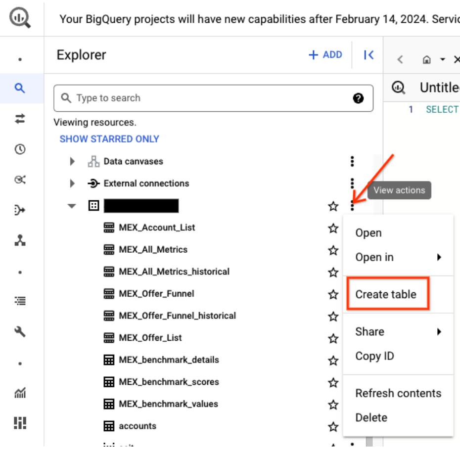
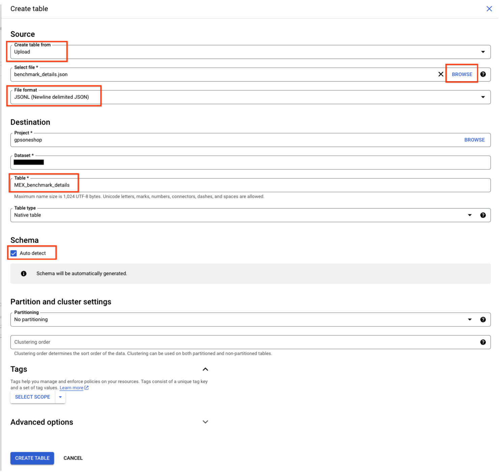

# Ads OneShop

## Description

Ads OneShop helps merchants identify opportunities to improve product data and
feature adoption, benchmarking against top retailers to maximise performance.

By implementing these recommendations, merchants can improve offer quality,
reduce disapprovals, increase advanced feature adoption and drive better auction
performance.

## Glossary

Acronym | Definition
------- | --------------------------------------------------
ACIT    | Advanced Customer Insights Tool / Shopping Insider
MEX     | Merchant Excellence
GMC     | Google Merchant Center
BQ      | BigQuery

## Overview

This runbook provides instructions on how to deploy ACIT/Shopping Insider and
MEX.

## Steps

### Setting up your Cloud environment

1.  **Create a GCP Project**
    *   Record the Project ID (referenced below as `$PROJECT_ID`).
2.  [**Enable APIs**](https://support.google.com/googleapi/answer/6158841)
    *   Google Ads API
        ([console link](https://console.cloud.google.com/marketplace/product/google/googleads.googleapis.com))
    *   Merchant Center API
        ([console link](https://console.cloud.google.com/marketplace/product/google/merchantapi.googleapis.com))
    *   Service Usage API
        ([console link](https://console.cloud.google.com/marketplace/product/google/serviceusage.googleapis.com),
        used for generating Application Default Credentials)
    *   Cloud Resource Manager API
        ([console link](https://console.cloud.google.com/marketplace/product/google/cloudresourcemanager.googleapis.com))
    *   BigQuery API
        ([console link](https://console.cloud.google.com/marketplace/product/google/bigquery.googleapis.com))
3.  **Configure OAuth**
    *   [**Consent Screen**](https://developers.google.com/workspace/guides/configure-oauth-consent)
        *   Select appropriate scopes for Ads, GMC, BQ.
        *   Usually, it's best to select an "internal only" OAuth consent
            screen.
    *   [**Create Desktop Credentials**](https://developers.google.com/workspace/guides/create-credentials#desktop-app)
        *   Remember to record Client ID and Client Secret.
4.  **Create a BigQuery dataset within your project**
5.  **(Optional) If you want to automatically update your ACIT data.**
    *   Create a VM
    *   Get a shell in the VM
    *   Follow remaining steps using the VM

### Product Prerequisites

#### Google Ads

*   [**Developer Token**](https://developers.google.com/google-ads/api/docs/get-started/dev-token)
    *   Standard Access is best, but Basic will work for prototyping/testing.
    *   As with the OAuth consent screen, it's easiest to get approval if you
        submit the request for "internal use only" (you are your own client),
        that is, if you don't plan to open up your app directly (i.e., sign in
        page) to people outside your company.
    *   **Important:** Legal entities are limited to one developer token per
        company/email domain. If you already have a token somewhere, you must
        use that token. You must not solicit a developer token from any other
        companies (i.e., you are an agency)
    *   **Pro Tip:** It does not matter what MCC the Developer Token comes from.
    *   There's an
        [alpha](https://ads-developers.googleblog.com/2023/09/developer-token-less-experience-for.html)
        right now for skipping the developer token entirely; all it's used for
        is identifying which company wrote the calling code.
*   **Google Merchant Center**

    *   Google Ads & Google Merchant Center accounts linked together.

    **NOTE:** If you'd like to use a service account with the Ads API and/or the
    Content API from Merchant Center, reach out to your dedicated technical
    Google contact.

### Environment Setup

On a Linux/Mac machine (or VM, or GCP console):

1.  **Download the code**

    *   Use the UI or any method you prefer, otherwise as below:

    ```bash
    git clone https://github.com/google/solutions/ads_oneshop
    cd ads_oneshop/
    ```

2.  **Ensure you have Python 3.9+ and set up a virtual environment**

    *   Create a virtual env. with the following commands:

    ```bash
    python -m venv ./.venv
    source ./.venv/bin/activate
    python -m pip install --upgrade -r acit/requirements.txt
    ```

3.  **Set up your GCP CLI**

    *   Run the following if you have not already logged into the gcloud SDK:

    ```bash
    gcloud auth login
    ```

    *   Replace $PROJECT_ID with your project id and run:

    ```bash
    gcloud auth application-default login --billing-project=$PROJECT_ID  --scopes="https://www.googleapis.com/auth/cloud-platform,https://www.googleapis.com/auth/userinfo.email,openid,https://www.googleapis.com/auth/content,https://www.googleapis.com/auth/sqlservice.login"
    ```

4.  **Generate a Refresh Token for Google Ads using this
    [Colab](https://colab.sandbox.google.com/drive/1GvLKn-oLZh3FRHalt_GqMB5hMTEBU1zz?resourcekey=0-8l6rwOt5Sfsah4eAHoAPSw).**

5.  Follow the instructions here and set the following in google-ads.yaml.

    *   Save it in your home directory:
    *   developer_token
    *   use_proto_plus: false
    *   client_id:
    *   client_secret:
    *   refresh_token

### Data Foundation Deployment

1.  **Set the following environment variables:**

```bash
export CUSTOMER_IDS=123,456 # must be top-level for now
export MERCHANT_IDS=456,789
export STAGING_DIR=$HOME/choose_any_other_existing_folder # if you want to set up multiple runs, it’s recommended to set this directory differently for each.
export PROJECT_NAME=your-project-name # This is PROJECT_ID
export DATASET_NAME=your_project_dataset
export DATASET_LOCATION=US
export ADMIN=true
export GOOGLE_ADS_CONFIGURATION_FILE_PATH=$HOME/google-ads.yaml
export REPORT_NAME="ACIT: Advanced Commerce Insights Tool"
```

**NOTE:** The IDs can be whatever length; they need to be without hyphens or
other punctuation. The comma is to delimit them if there are more than one.

**TIP:** optionally, you can save the above variables in a file, and load it to
your shell environment with an replacement for $YOUR_ENV_FILE `bash set -a &&
source $YOUR_ENV_FILE && set +a`

1.  **From the root repository, run:

```bash
acit/run_acit.sh
```

### OPTIONAL Automation

**Only follow these steps if you want to automate the run of ACIT**

If you've been doing these steps on a machine that will be refreshing ACIT data
automatically, these are steps to get this done:

*   Scheduling this to run with a cron job
*   The Code should be cloned to a directory, such as ~/ads_oneshop (assuming
    this directory will be used for the rest of the instructions)

**Create a data directory**

```bash
mkdir -p $HOME/acit_data
```

**To set up the Python environment, run:**

```bash
cd ~/ads_oneshop && python -m venv .venv && source ./.venv/bin/activate && python -m pip install --upgrade -r acit/requirements.txt
```

In your workspace home folder, create a file named "acit.env.prod" (or anything
you like) and paste it in the following variables, which will be sourced as
environment variables for the entrypoint:

```bash
CUSTOMER_IDS=123,456 # must be top-level for now
MERCHANT_IDS=456,789
STAGING_DIR=$HOME/choose_any_other_existing_folder
PROJECT_NAME=your-project-name
DATASET_NAME=your_project_dataset
DATASET_LOCATION=US
ADMIN=true
```

to bootstrap everything together, let's create a wrapper script in the home
directory called "acit_wrapper.sh", which can be used in a cron job:

```bash
#!/bin/bash

set -e

echo "Loading environment variables from file $1"
set -a
source $1
set +a

echo "Running ACIT"
cd $HOME/advanced_commerce_insights_tool
source ./.venv/bin/activate
acit/run_acit.sh
```

**Finally, run:**

```bash
chmod +x ~/acit_wrapper.sh
```

**Initial Run**

**To run, all you have to do is execute**

```bash
bash ~/acit_wrapper.sh ~/acit.env.prod
```

### ACIT Dashboard Deployment

*   To be able to access the template below, join the
    [Ads OneShop public Google group](https://groups.google.com/g/ads-oneshop).
    *   The group is **open**, no need to request access.
    *   Just press 'Join Group' when **logged in with a Google Account**.)
*   Make a Copy of the
    [template](https://lookerstudio.google.com/c/u/0/reporting/0cbb3e05-67af-4521-b4c2-d731f1ca78ee/page/RLaHD).
*   Update data sources to use BQ dataset.

### MEX Deployment

*   Download and save the benchmark files.
    *   [benchmark_details.json](benchmark/benchmark_details.json)
    *   [benchmark_values.json](benchmark/benchmark_values.json)
*   Go to BigQuery in GCP and click on the dataset's 3 dot menu



*   Follow the example below and upload the benchmark details and values files
*   **Please follow the recommended names:**
    *   MEX_benchmark_details
    *   MEX_benchmark_values
*   (Repeat the example below for the values file as well)



*   After the files have been uploaded successfully, verify that those tables
    have been created. Return to your command line and follow the instructions
    below.

**From the root repository, run:** `bash
extensions/merchant_excellence/run_acit_mex.sh`

*   Load benchmark JSONs.

### MEX Dashboard Deployment

*   To gain access to the template, ensure you've joined the
    [public group](https://groups.google.com/g/ads-oneshop) as pointed out
    previously.
*   Copy the
    [template](https://lookerstudio.google.com/c/u/0/reporting/c9b47c32-f5b8-4ad5-a59f-495b0e58dbc8/page/ 2RkaD)
*   Update data sources to use BQ dataset.
